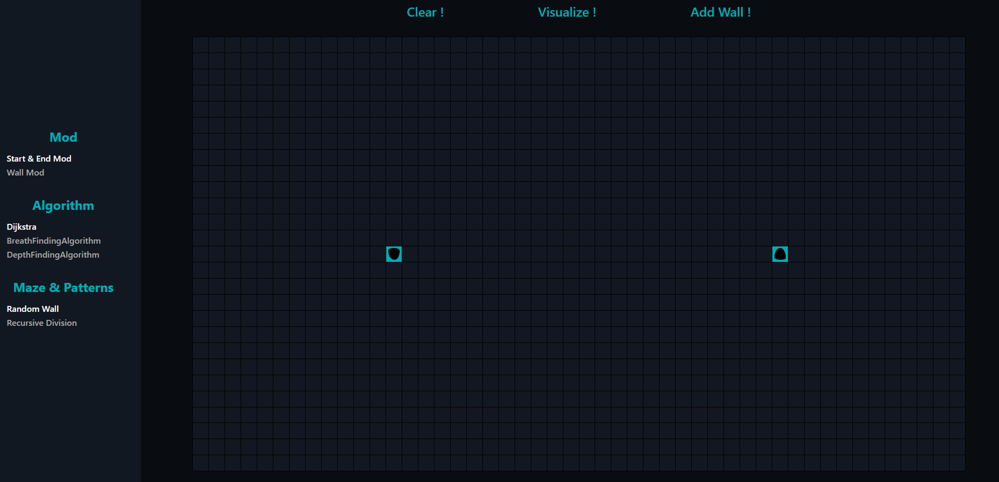

# Pathfinding algorithm visualizer using graph
This is a web application where we can visualise different pathfinding algorithm.

## Algorithm
- Dijkstra
- Breath finding algorithm
- Depth finding algorithm
## Mods
- Start & End mod : change the position of start and end nodes
- Wall mod : add or remove wall
## Maze & Patterns
Currently, we can only add random wall.